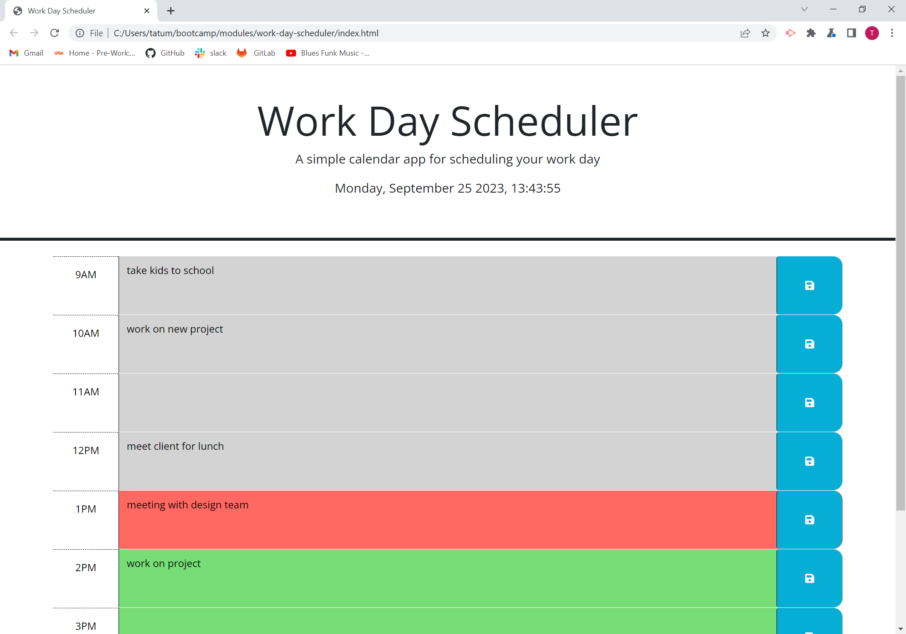

# work-day-scheduler
https://tatumsterling.github.io/work-day-scheduler/
## Description
This application is a work-day scheduler. It was created by using javascript, HTML, CSS, bootstrap, dayjs and JQUERY to best organize and display the features of this app. The time slots start at 9am and stop at 5pm to create a schedule for the typical 8 hour work day. After the user inputs a task into the time slot, it will be saved to their local storage to be utilized later. 

## Installation

N/A

## Usage

to deploy this webpage, click on the link in the top of the README file and it will take you to the work day scheduler. Below is a screenshot of what the webpage should look like. This application is designed to show the current day. If the time slot is in the past, the text box will be grey. If the time slot is in the present hour, it will display red, and lastly if the time slot is in the future it will display green. Each hour has a text box that will save user input. 

## Credit 
N/A

## License 
Please refer to the LICENSE in the repo.
